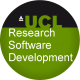

% A Proposal for Important Work 
% Prof. I. Principal, (Lecturer, Dept. Chemistry)[^2]; Dr D. Post (RA, dept. Economics)[^1] ; G. Student (PhD Student, Pharmacology)
% December 2013

[^1]:Corresponding, d.post@ucl.ac.uk,Tel. 0203 549 0000
[^2]:Principal Investigator

Abstract
========

This should fit within the first page. It should cover the points you consider most important in 
judging your proposal. While shortlisting, the panel may read only this section. You should
select points from amongst the later sections to emphasise here.

Note that though you may find this template in word, latex, or markdown, you must submit your proposal as a PDF file.

\pagebreak

Introduction
============

Introduction to research area
-----------------------------

* Assume a basic knowledge of the subject
  * As to a starting graduate student
* Include key publications which can build a grounding in the field
* Review the status of computational research in the area
  * References to any existing codes which complement or compete with the code being proposed for effort

Introduction to research group
------------------------------

* Authors’ track record in the field
* Recent publications[@example]
	* Including those that will help the team understand the code to be worked on
* Computational experience of group
	* Software training levels, languages, and competencies of staff
	* Existing processes and tools used for organizing software development effort

Introduction to code to be worked on
------------------------------------

  * If a brand new code, envisaged answers can be given
  * Overview of code purpose and use
    * References to documentation or papers if available
  * High level description of code structure and design approaches
    * Suitable to help someone first looking at the code base
  * Elements used, with references to web or research literature where appropriate:
    * Languages
    * Libraries
    * Techniques and methods
    * Algorithms
    * Build tools
    * Testing and deployment tools
  * Important: provide [URL links](http://github.com/) to existing code or email as attachment
  * Engineering status of existing code, with impact on research
    * Degree of testing
    * Incidence of crash or wrong-answer bugs 
    * Performance issues
    * Readability and structural soundness

Suggested Objectives for The Project
====================================

* Suggested objectives for the project
  * Organised by priority
  * All must be justified in terms of research needs and impact
    * Why is this feature or improvement needed?
    * What will be the outcomes for the research group, for UCL, and for the field if this is implemented
  * Final objectives will be agreed in collaboration with the team if selected
    * Support for further requirements analysis will be provided as part of the project
    * Effort is provided on a defined-effort not defined-outcome basis
  * See [example suggested objectives](http://development.rc.ucl.ac.uk/termly-call/examples.html)

Impact of the project
=======================

Potential for use of software beyond originating group
------------------------------------------------------

  * Development of software components, tools, insight or methods which could be of benefit to other research projects
  * Potential for receipt of otherwise unavailable research funding
  * Prevention of software falling into disuse or being forgotten
  * Development of skills within research group
    * Transfer of software engineering knowledge to active computationally-focused PhD students and postdocs
  * Unlocking potential for further development of code beyond engagement

Sustainability of the project
-----------------------------
  * How will the work project be maintained after RSDT free involvement ceases?
  * If by group staff, show that the group has the skills to maintain the code, or how these skills will be acquired (possibly with RSDT help).
  * If through subsequent paid work by RSDT, specify where resources will come from, either through existing funds or future grant applications.

Justification for application
=============================

Justification for use of RSDT staff
-----------------------------------

* See appropriateness section in [selection criteria](http://development.rc.ucl.ac.uk/termly-call/selection.html)
* Why are research software developers required as opposed to general programmers?
* Why can’t existing research staff do this?

Justification for use of free project
-------------------------------------

* Existing chances of receiving funding for software development from other sources
* Impact of project on those chances

